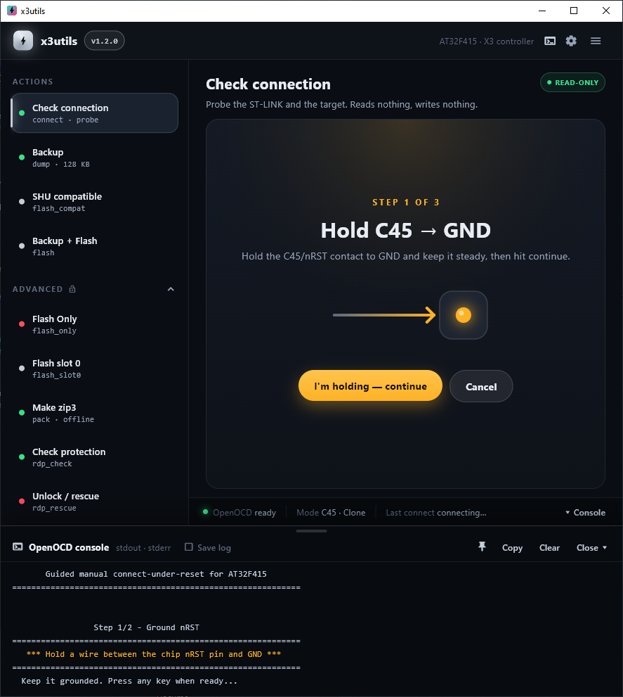
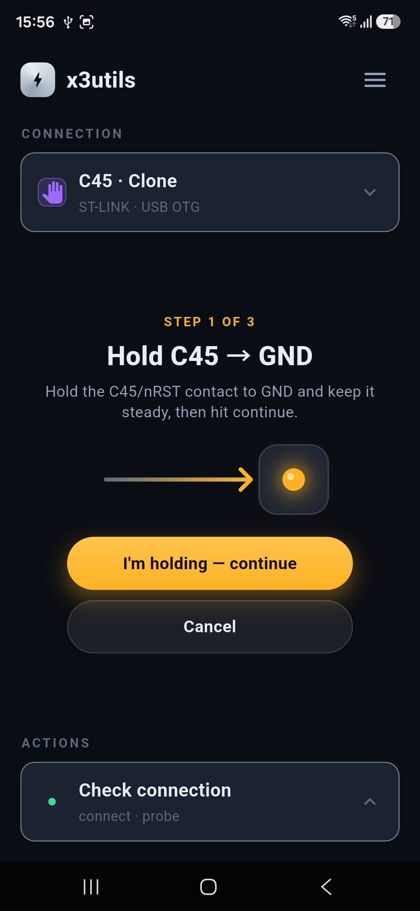
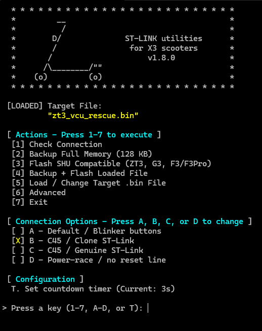

*README in progress ...*

<table><tr><td>

### Latest Downloads

- **[GUI v2.1.7 BETA](https://github.com/ztakis/x3utils/releases/tag/gui-v2.1.7-beta)** — latest test build for Windows, Linux and macOS plus arm64 Android APK.
- **[GUI v2.1.0](https://github.com/ztakis/x3utils/releases/tag/gui-v2.1.0)** — desktop app for Windows, Linux and macOS, plus an arm64 Android APK for sideloading.
- **[CLI v1.8.1](https://github.com/ztakis/x3utils/releases/tag/v1.8.1)** — terminal scripts for Windows, Linux and macOS.

### Web App

- **[x3utils-web v2.1.0](https://x3utils-web.pages.dev/)** — Chrome and Edge desktop browsers.
- **[x3utils-phone v2.1.0](https://x3utils-web.pages.dev/m/)** — Android phones using Chrome; a subset of the desktop tools with the Android layout.

WebUSB requires Chrome or Edge. Firefox and Safari are unsupported, and no iPhone or iPad browser will work.
> [!CAUTION]
> **SHU compatibility firmware limits:** Do not use Flash SHU Compatible with F3/G3 VCU 1.6.3 or newer, or ZT3 VCU 1.5.9 or newer. GT3 is not supported by Flash SHU Compatible at any version (its own limit, VCU 1.7.2, is listed for reference only). SHU compat saves the original backup first, but using it on newer firmware may require restoring that backup.

</td></tr></table>

<!-- <h2></h2> -->

# x3utils

### ST-LINK utilities for X3 / 3rd-generation scooters.

*Supported models: ZT3 Pro, Max G3, F3 / F3 Pro*

<table><tr>
<td></td>
<td></td>
</tr></table>

## What This Tool Does

x3utils talks to the scooter VCU over ST-LINK / SWD. It makes full firmware backups, flashes firmware, runs SHU-compatible patch flashing, and checks or rescues a locked chip.
The desktop GUI covers Windows, Linux and macOS. Web and Android provide direct ST-LINK subsets, while the CLI scripts offer the desktop workflow from a terminal.
> [!WARNING]
> This tool talks directly to the scooter VCU. A bad connection, wrong file, or interrupted flash can leave the controller unusable until recovered. Always make a full dump first and keep the backup somewhere safe.

## Quick Start

**Watch the quick video first.**

This video shows the older CLI flow, not the current GUI. A GUI walkthrough is planned.

1. Download the latest release for your platform.
2. Make a full backup before you flash anything.
3. Follow the guide for your platform: [Windows](x3utils_win/README.md), [Linux](x3utils_linux/README.md), [macOS](x3utils_mac/README.md).

## CLI Scripts

The original CLI scripts still work and cover the same operations as the GUI, for anyone who prefers the terminal.

## More Documentation

- [Windows guide](x3utils_win/README.md)
- [Linux guide](x3utils_linux/README.md)
- [macOS guide](x3utils_mac/README.md)
- [Wiki home](https://github.com/ztakis/x3utils/wiki)
