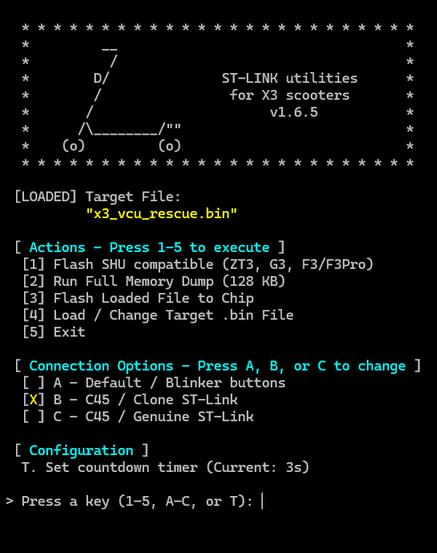

*README in progress ...*  

# x3utils

### ST-LINK utilities for X3 / 3rd-generation scooters.

### Supported models: ZT3 Pro, Max G3, F3 / F3 Pro.

> [!WARNING]
> This tool talks directly to the scooter VCU. A bad connection, wrong file, or interrupted flash can leave the controller unusable until recovered. Always make a full dump first and keep the backup somewhere safe.

## Quick Start

**Watch the quick video first.**

This short video shows the normal Windows + clone ST-LINK flow: launcher on one side, test board and C45 timing on the other.

Need the full explanation? Watch the long version:

*Long YouTube walkthrough: coming soon.*

<!-- [Youtube video coming soon..](https://www.youtube.com/watch?v=VIDEO_ID) -->

Quick steps:

1. Download the latest x3utils release.
2. Open `x3utils_win`.
3. Run `launcher.bat`.
4. Select `B - C45 / Clone ST-Link`.
5. Run option `2` first to make a full 128 KB backup.
6. Do not flash anything until the dump works.

If option `2` works, your ST-LINK connection is probably good enough for the next steps.

## What This Tool Does

### The launcher has five main actions:

`[1] Flash SHU compatible`

Dumps your current VCU firmware, patches it, and flashes it back for SHU-compatible workflows such as flashing from repo or changing serial. Use at your own risk.
[More info >](https://github.com/ztakis/x3utils/wiki/33.-SHU-compatible-workflow)

`[2] Run Full Memory Dump (128 KB)`

Makes a full backup. Run this first.
[More info >](https://github.com/ztakis/x3utils/wiki/30.-Backups-and-flashing-safely)

`[3] Flash Loaded File to Chip`

Flashes the `.bin` file selected with option `4`.
[More info >](https://github.com/ztakis/x3utils/wiki)

`[4] Load / Change Target .bin File`

Selects the `.bin` file to flash. Normal firmware files must be exactly 128 KB.
<!-- [More info >](https://github.com/ztakis/x3utils/wiki) -->

`[5] Exit`

Closes the utility.

### Connection Modes

`A - Default / Blinker buttons`

Use this when SWD is available, either normally or by holding the turn indicator buttons during power-up.
[More info >](https://github.com/ztakis/x3utils/wiki/11.-Default-SWD-and-blinker-buttons)

`B - C45 / Clone ST-Link`

Most common mode. Use this with clone ST-LINK adapters. The launcher tells you when to touch C45 to `GND`.
[More info >](https://github.com/ztakis/x3utils/wiki/12.-Clone-ST-LINK-C45-mode)

`C - C45 / Genuine ST-Link`

Use this with a genuine ST-LINK adapter and its reset pin connected to the MCU reset line at C45.
[More info >](https://github.com/ztakis/x3utils/wiki/13.-Genuine-ST-LINK-reset-mode)

## More Documentation

- [Windows guide](x3utils_win/README.md)
- [Linux guide](x3utils_linux/README.md)
- [macOS guide](x3utils_mac/README.md)
- [Wiki home](https://github.com/ztakis/x3utils/wiki)
