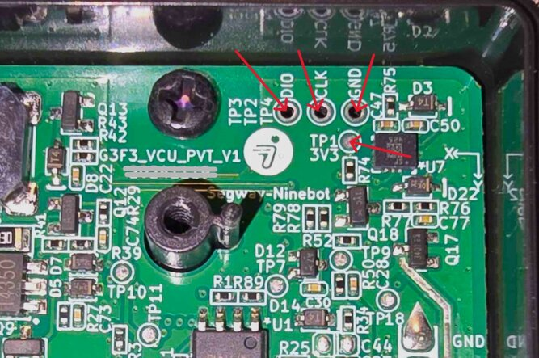

Use this page before connecting anything to the VCU.

## Required Signals

For normal SWD access you usually need:

- `SWDIO`
- `SWCLK`
- `GND`
- 3.3 V reference if your adapter needs target voltage sensing

For connect-under-reset modes you also need access to reset:

- genuine ST-LINK: connect the adapter reset pin to the MCU `nRST` line;
- clone ST-LINK: manually connect C45 to `GND` when prompted by the launcher.

On these VCUs, capacitor C45 is connected to the MCU reset line.

## Important Notes

- Do not rush the wiring.
- Use short, stable wires.
- Keep `GND` connected.
- Avoid holding probes by hand while flashing if possible.
- If the tool gives cryptic OpenOCD errors, check the physical connection first.

## Images

### ST-LINK pinout for G3/F3  

 

### ST-LINK pinout for new G3  

 

### ST-LINK pinout for ZT3  

 

### ST-LINK pinout for X3 MCU  

