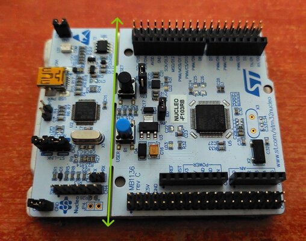
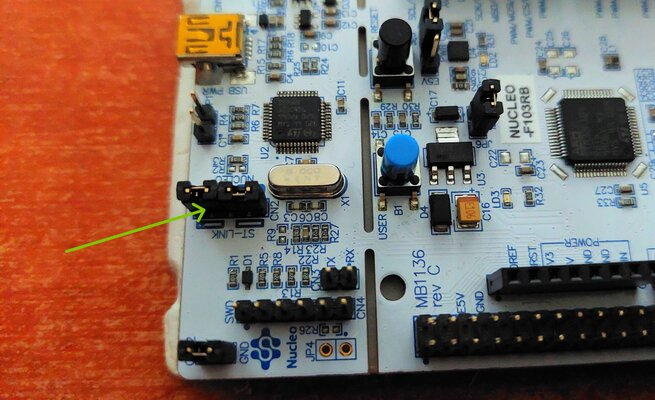
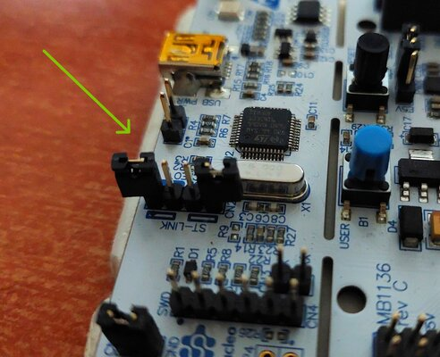
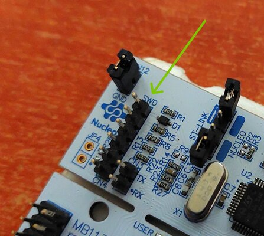
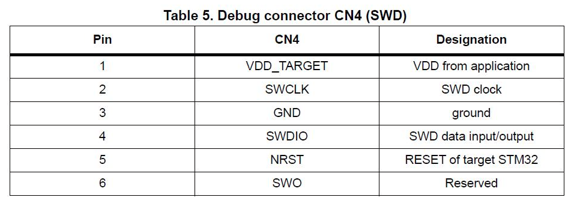
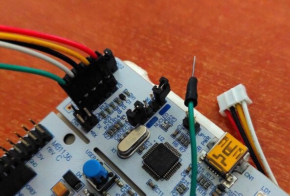
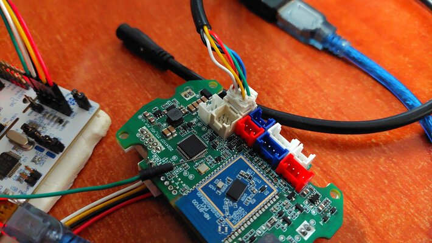

# 8. Genuine ST-Link Guide

Use this page for mode:

```text
[C] C45 / Genuine ST-Link
```

This mode is for genuine ST-LINK adapters with a working reset pin.

## Wiring

Connect normal SWD signals:

- `SWDIO`
- `SWCLK`
- `GND`
- target voltage reference is required

Also connect the genuine ST-LINK reset pin to the MCU `nRST` line *continuously*. On these VCUs, `nRST` is available at capacitor C45.

## Why This Is Easier Than Clone Mode

A genuine adapter can control reset directly, so the user does not need to manually short C45 to `GND` during a countdown.

## First Test

Run option `2` first:

```text
[2] Run Full Memory Dump (128 KB)
```

If the dump works and verify-style reads are stable, flashing is much less likely to fail because of wiring.

For this I used the st-link part from a cheap Nucleo board (~20 Euros).   
The left part is the st-link part and you need to remove those two jumpers,
to work with external devices.


<br />

<br />

<br /><br />

Those are the SWD pins and the pinout table (top pin is #1).

  

<br /><br />

Red cable does not provide power to the dashboard.  
It measures the voltage of the target's 3.3V line.  
You have to connect this at the dashboard's SWD 3.3V pin  
and give power from the main connector.   
Yellow, Black & White are SWCLK, GND & SWDIO respectively.  
Green is the reset (NRST) and you need to connect this to the C45 capacitor.
<br />

  
  

<br /><br />
