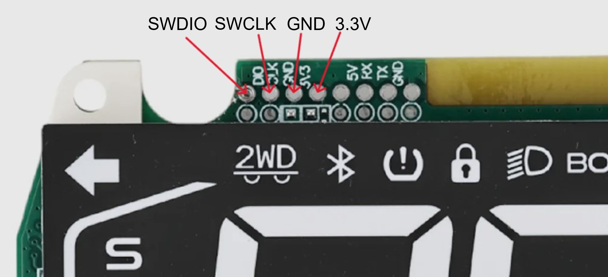
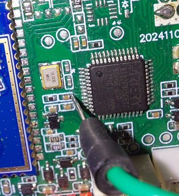
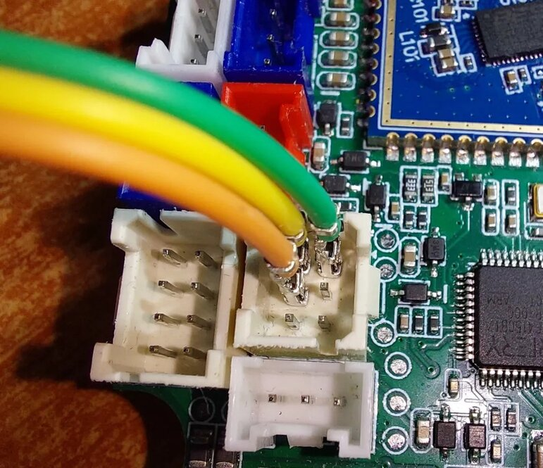
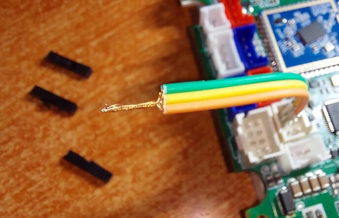
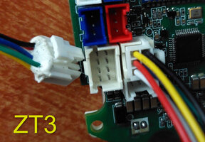
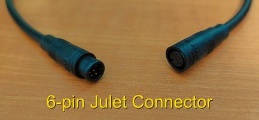
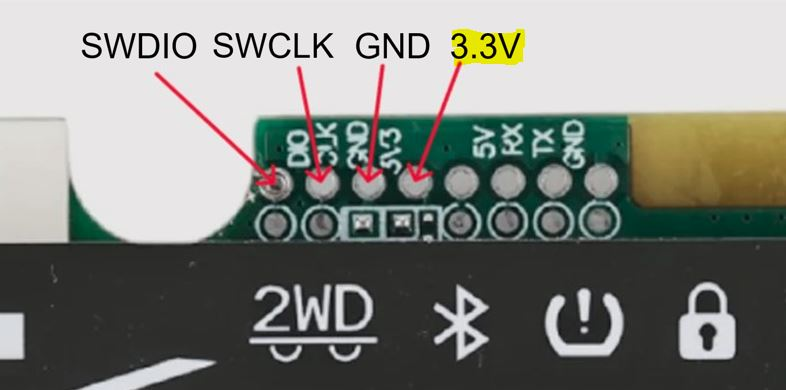

<!-- # ZT3 Pro Guide -->

This page is for the ZT3 Pro VCU.

## Status

TBD

## Board Photos

TBD

## ST-LINK Pinout

## C45 Location

## Blinker / Service Mode Pinout

## Power Options

Use one power method only.

### Option 1: Main Power

### Option 2: ST-LINK 3.3 V

Do not use both at the same time.

## Connection Sequence

TBD

## Practical Trick

TBD

## First Test

Run a full 128 KB dump before flashing anything.

## Known Problems

TBD
