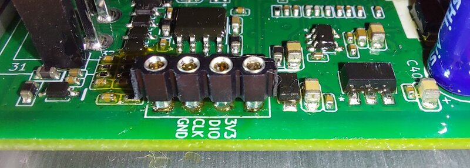

<!-- # X3 Motor Control Unit -->

This page is for the scooter Motor Control Unit.

In scooter discussions, `MCU` usually means **Motor Control Unit**. To avoid confusion, this wiki uses `chip`, `CPU`, or `microcontroller` when talking about the processor on a board.

## Status

Early guide / notes.

Current working assumption:

- X3 Motor Control Unit hardware is probably the same across X3 scooters;
- pinout appears to be the same;
- confidence is high, but not 100 percent confirmed across every model.

## How This Differs From The VCU

The VCU is the Vehicle Control Unit.

The Motor Control Unit is a separate scooter module. The VCU and Motor Control Unit communicate over CAN bus.

x3utils can be used around both concepts, but the wiring and procedure should be documented separately.

## Recommended Connection Mode

Use:

```text
A - Default / Blinker buttons
```

With current Motor Control Unit firmware, SWD appears to remain available, so connect-under-reset is not normally needed.

## ST-LINK Pinout



TBD

Confirm the pin labels from the photo before using this as a final guide.

Expected useful signals:

- `SWDIO`
- `SWCLK`
- `GND`
- 3.3 V reference / power note

## Power Options

TBD

Document the safe power method clearly.

Do not connect multiple power sources unless the final guide explicitly says it is safe.

## Dump / Flash Notes

TBD

First test should still be a full dump before any flashing.

## Known Differences Between Scooter Models

TBD

If the same Motor Control Unit board is confirmed across more models, document the evidence here.

## Help Wanted

Useful contributions:

- clear photos of the Motor Control Unit board;
- ST-LINK pinout confirmation;
- successful dump notes;
- successful flash notes;
- firmware version notes such as `mcu_v1.x.x`.
